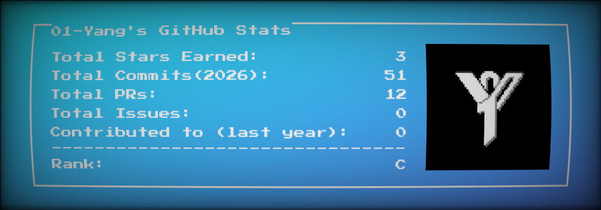

<!-- Generated automatically. Edit config/profile.json or scripts/generate.mjs instead. -->

<h1 align="center">01-Yang</h1>

<strong>这场 AI 革命，没有人能够置身事外！</strong>

以 AI 为引擎，于 零一 之间探索，在 日新 之中迭代！

<strong>AI 独立开发｜实践分享｜零一 AI 日新社 社长</strong>

 

  

 

## PROJECTS / 代表项目

<table>
<tr>
<td width="50%" valign="top">
<h3><a href="https://github.com/XiaoSiKe/zero-one-api">zero-one-api ↗</a></h3>

零一 API：基于 Sub2API 的定制网关、控制台与运维工具

<code>Go</code> &nbsp;·&nbsp; 1 STAR · <a href="https://api.01yapi.com">LIVE ↗</a>
</td>
<td width="50%" valign="top">
<h3><a href="https://github.com/XiaoSiKe/The-25th-Hour">The-25th-Hour ↗</a></h3>

《第二十五小时：建筑生模拟器》网页游戏源码、素材与开发文档

<code>JavaScript</code> &nbsp;·&nbsp; 1 STAR · <a href="https://arch.25thgame.vip/game.html">LIVE ↗</a>
</td>
</tr>
<tr>
<td width="50%" valign="top">
<h3><a href="https://github.com/XiaoSiKe/01yang-company-website">01yang-company-website ↗</a></h3>

福州零一扬网络科技有限公司官网｜AI SaaS、模型 API、软件开发、网络服务与 AI 教育｜React + TypeScript，阿里云独立部署

<code>TypeScript</code> &nbsp;·&nbsp; 1 STAR · <a href="https://www.01yang.space">LIVE ↗</a>
</td>
<td width="50%" valign="top">
<h3><a href="https://github.com/XiaoSiKe/zero-one-api-verifier">zero-one-api-verifier ↗</a></h3>

零一智鉴 · API 真测雷达：开源 AI API 中转站风险检测平台

<code>Python</code> &nbsp;·&nbsp; 0 STARS · <a href="https://mix.01yapi.cc">LIVE ↗</a>
</td>
</tr>
</table>

 

  BUILD IN PUBLIC · KEEP SHIPPING · STAY CURIOUS 
  自动更新于 2026/08/31 08:51 (UTC+8) · Pixel card powered by <a href="https://github.com/LuciNyan/pixel-profile">pixel-profile</a>

